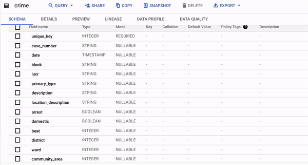
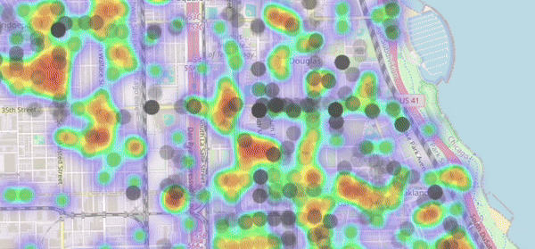
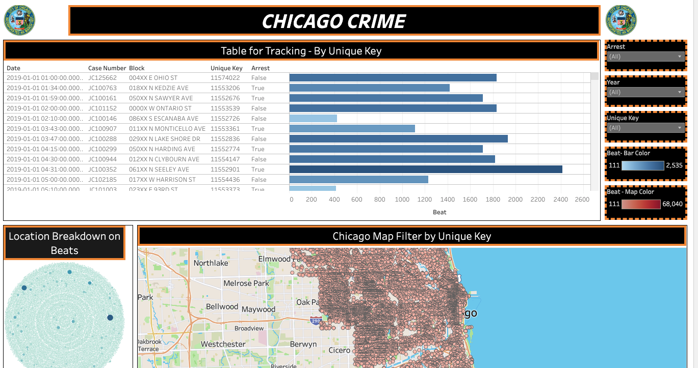

<body>
    <header>
        <h1> Chicago Crime
</h1>
    </header>
<body style="background-color: #f0f0f0;">

    <h2>Introduction</h2>
    

        In this presentation, we embark on a detailed exploration of reported crime incidents in Chicago, a dataset that extends from 2001 to the current date, excluding the most recent seven days. This data is extracted from the Chicago Police Department's Citizen Law Enforcement Analysis and Reporting (CLEAR) system, reflects a broad spectrum of crime incidents, with a notable exception for murders where each victim's data is separately recorded.

A key aspect of this dataset is its commitment to the privacy of crime victims. To this end, the information is generalized to the block level, without pinpointing specific locations. It's important to highlight that the dataset encompasses unverified reports and preliminary crime classifications that may be subject to change following further investigation. This aspect underscores the dynamic and somewhat tentative nature of the data.

Given the potential for mechanical or human error, the Chicago Police Department explicitly states that the accuracy, completeness, timeliness, or correct sequencing of the data cannot be guaranteed. As a result, this dataset should not be used for time-based comparative purposes.

This presentation aims to provide a data-driven narrative on public safety in Chicago. We will delve into this rich dataset, publicly available under the terms provided by the City of Chicago and offered 'AS IS' by Google, to uncover patterns, understand trends, and offer insights into the complex domain of urban crime and safety." For more information visit: [click here
](https://data.cityofchicago.org)    

    <h2>Table of Contents</h2>
    <ul>
        <li><a href="#Installation">Installation and Setup</a></li>
        <li><a href="#Usage">Usage</a></li>
        <li><a href="#Dataset">Dataset</a></li>
        <li><a href="#Analysis">Analysis</a></li>
        <li><a href="#Visuals">Visuals</a></li>
        <li><a href="#Resources">Resources</a></li>
        <!-- Add other sections as needed -->
    </ul>

    <h2>Installation and Setup</h2>
    
Querying massive datasets can be time consuming and expensive without the right hardware and infrastructure. Google BigQuery solves this problem by enabling super-fast, SQL queries against append-mostly tables, using the processing power of Google's infrastructure.
 
- [<a href="https://cloud.google.com/python/docs/reference/automl/latest"> Client Library Documentation</a>](https://popcenter.asu.edu/sites/default/files/learning/60steps/index3f62.html?stepNum=25)
 
 
- <a href="https://cloud.google.com/bigquery/docs/reference/rest"> Product Documentation </a>
 
 
    <table> 
    SQL Code Configuration
    <tr>
    <td> 
        SQL Code: <a href="https://github.com/dsrichard97/chicagosql"> Pull Request raw code</a>
    </td>
    </tr>
    </table> 
 

    

Quick overview of SQL alias list.
    
    <!-- Gets data from the last 5 years -->
    SELECT * FROM `bigquery-public-data.chicago_crime.crime` WHERE year >= EXTRACT(YEAR FROM CURRENT_DATE()) - 5;

    <h2>Usage</h2>
    
 The usuage is for law enforcement people or people who intrested in crime data. The intention of this project is rather to raise awareness of crimes and hotspots.

    <h2>Dataset</h2>
    
 If you are intrested in looking at the sql pull look at the previous. However, I highlighted most of my energy and portion into visuals to show the rise of crime from 2019-2023. The tableau link includes a high level overview of the data. For more programmers, I have attached a link to python file and r code that display a temporal analysis. Crime rates have been up and the goal is to raise awareness of how important governement officials are. This specifically highlights hotspots. 

    <h2>Analysis</h2>
        
    
The report titled 'Chicago Crime Data Reporting,' dated January 5, 2024, offers a thorough exploratory data analysis (EDA) and a detailed temporal evaluation of crime statistics in Chicago for the years 2022-2023. Executed using R and various libraries including readr, lubridate, dplyr, ggplot2, leaflet, leaflet.extras, and cluster, the analysis covers data preparation, identifying predominant crime types through bar plots, and a block-level scrutiny to pinpoint regions with heightened specific criminal activities. The study further investigates time-related trends in these areas, revealing notable shifts in crime frequencies. A key highlight of this analysis is the fusion of geospatial and temporal visualizations with interactive maps, augmented by machine learning techniques such as K-means clustering to delineate crime hotspots. This all-encompassing method not only sheds light on crime concentration and critical zones but also provides valuable insights for decision-making by policymakers and law enforcement bodies. This analysis serves as a powerful instrument in comprehending and tackling the nuances of urban crime. 
        - <a href="https://rpubs.com/diazrichard98/1135536">Rmarkdownfile</a>  

    <!-- Include code snippets and screenshots -->

    <h2>Visuals</h2>
    
    
Check out my Tableau dashboard: https://public.tableau.com/shared/2ZZDXFHQX?:display_count=n&:origin=viz_share_link  

    

        <h2>Resources</h2>
        

            <a href="https://popcenter.asu.edu/sites/default/files/learning/60steps/index3f62.html?stepNum=25">Crime Analysis in 60 steps</a> 
            <a href="https://projects.itrcweb.org/gsmc-1/Content/GW%20Stats/5%20Methods%20in%20indiv%20Topics/5%208%20Temporal%20Analysis.htm">Motivation</a> 
            <a href="https://pro.arcgis.com/en/pro-app/latest/help/mapping/time/temporal-data.htm">ArcGIS Pro Time Series Data Store Values</a>
        

    

