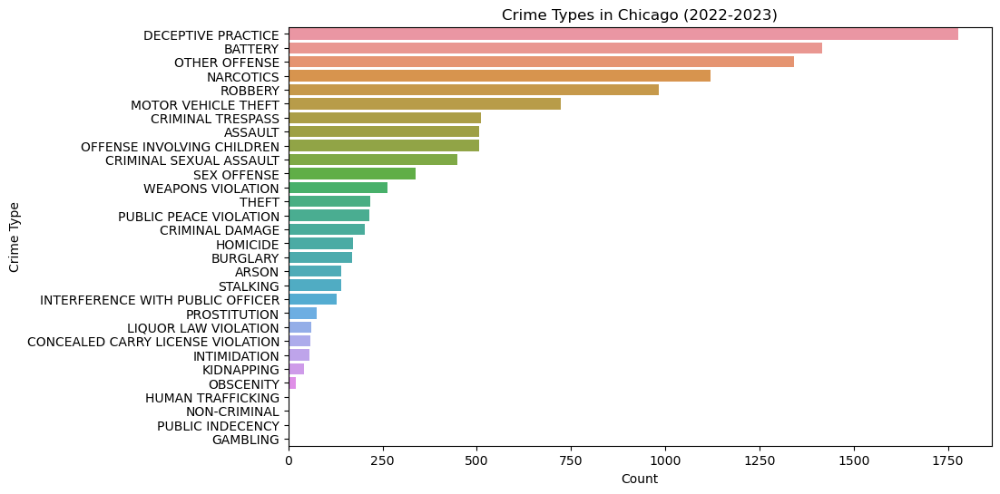
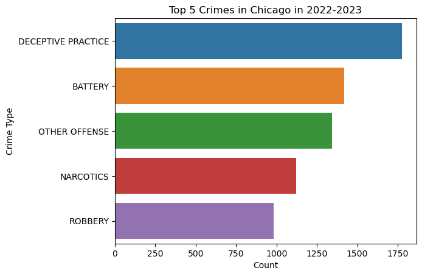
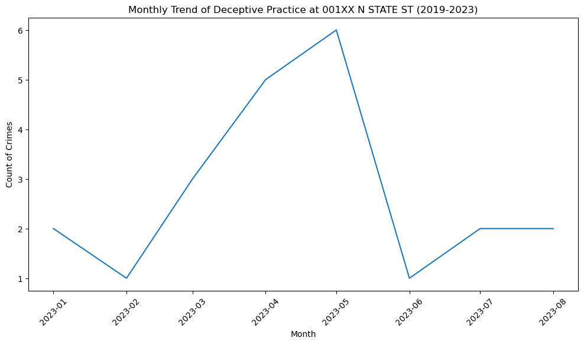
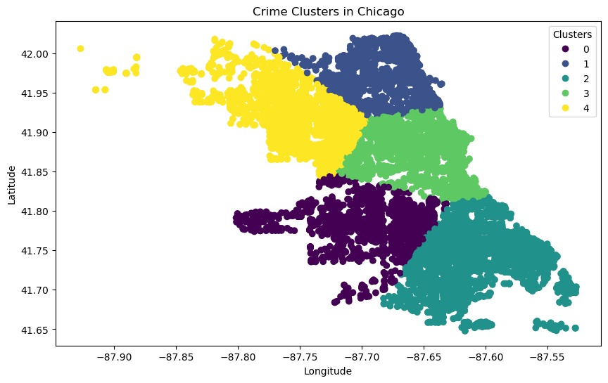

## CRIME DATA 
### About the data?
In this presentation, we embark on a detailed exploration of reported crime incidents in Chicago, a dataset that extends from 2001 to the current date, excluding the most recent seven days. This data is extracted from the Chicago Police Department's Citizen Law Enforcement Analysis and Reporting (CLEAR) system, reflects a broad spectrum of crime incidents, with a notable exception for murders where each victim's data is separately recorded. A key aspect of this dataset is its commitment to the privacy of crime victims. To this end, the information is generalized to the block level, without pinpointing specific locations. It's important to highlight that the dataset encompasses unverified reports and preliminary crime classifications that may be subject to change following further investigation. This aspect underscores the dynamic and somewhat tentative nature of the data. Given the potential for mechanical or human error, the Chicago Police Department explicitly states that the accuracy, completeness, timeliness, or correct sequencing of the data cannot be guaranteed. As a result, this dataset should not be used for time-based comparative purposes. This presentation aims to provide a data-driven narrative on public safety in Chicago. We will delve into this rich dataset, publicly available under the terms provided by the City of Chicago and offered 'AS IS' by Google, to uncover patterns, understand trends, and offer insights into the complex domain of urban crime and safety."

For information on SQL PULL: https://github.com/dsrichard97/chicagosql

For more information please visit the following link: https://dsrichard97.github.io/chicago_crime/

## 1. LOADING THE DATA 


```python
import pandas as pd
import numpy as np
from datetime import datetime
import matplotlib.pyplot as plt
import seaborn as sns
from sklearn.cluster import KMeans

# Load data
crimedf = pd.read_csv("~/Desktop/crimedataquery.csv")
crimedf.head(5)
```


<div>
<style scoped>
    .dataframe tbody tr th:only-of-type {
        vertical-align: middle;
    }

    .dataframe tbody tr th {
        vertical-align: top;
    }

    .dataframe thead th {
        text-align: right;
    }
</style>
<table border="1" class="dataframe">
  <thead>
    <tr style="text-align: right;">
      <th></th>
      <th>unique_key</th>
      <th>case_number</th>
      <th>date</th>
      <th>block</th>
      <th>iucr</th>
      <th>primary_type</th>
      <th>description</th>
      <th>location_description</th>
      <th>arrest</th>
      <th>domestic</th>
      <th>...</th>
      <th>ward</th>
      <th>community_area</th>
      <th>fbi_code</th>
      <th>x_coordinate</th>
      <th>y_coordinate</th>
      <th>year</th>
      <th>updated_on</th>
      <th>latitude</th>
      <th>longitude</th>
      <th>location</th>
    </tr>
  </thead>
  <tbody>
    <tr>
      <th>0</th>
      <td>11587320</td>
      <td>JC140984</td>
      <td>2019-01-11 12:01:00.000000 UTC</td>
      <td>001XX N WABASH AVE</td>
      <td>1122</td>
      <td>DECEPTIVE PRACTICE</td>
      <td>COUNTERFEIT CHECK</td>
      <td>OTHER</td>
      <td>False</td>
      <td>False</td>
      <td>...</td>
      <td>42.0</td>
      <td>32.0</td>
      <td>10</td>
      <td>1176785.0</td>
      <td>1901619.0</td>
      <td>2019</td>
      <td>2019-02-13 04:01:17.000000 UTC</td>
      <td>41.885389</td>
      <td>-87.626266</td>
      <td>(41.885389294, -87.626265771)</td>
    </tr>
    <tr>
      <th>1</th>
      <td>11792012</td>
      <td>JC389748</td>
      <td>2019-08-12 01:30:00.000000 UTC</td>
      <td>001XX N DEARBORN ST</td>
      <td>1152</td>
      <td>DECEPTIVE PRACTICE</td>
      <td>ILLEGAL USE CASH CARD</td>
      <td>RESTAURANT</td>
      <td>False</td>
      <td>False</td>
      <td>...</td>
      <td>42.0</td>
      <td>32.0</td>
      <td>11</td>
      <td>1175916.0</td>
      <td>1901339.0</td>
      <td>2019</td>
      <td>2019-08-19 03:53:06.000000 UTC</td>
      <td>41.884641</td>
      <td>-87.629465</td>
      <td>(41.884640562, -87.629465296)</td>
    </tr>
    <tr>
      <th>2</th>
      <td>11695143</td>
      <td>JC272910</td>
      <td>2019-05-21 08:05:00.000000 UTC</td>
      <td>0000X E WACKER PL</td>
      <td>1305</td>
      <td>CRIMINAL DAMAGE</td>
      <td>CRIMINAL DEFACEMENT</td>
      <td>RESTAURANT</td>
      <td>True</td>
      <td>False</td>
      <td>...</td>
      <td>42.0</td>
      <td>32.0</td>
      <td>14</td>
      <td>1176954.0</td>
      <td>1902140.0</td>
      <td>2019</td>
      <td>2019-06-30 03:41:21.000000 UTC</td>
      <td>41.886815</td>
      <td>-87.625629</td>
      <td>(41.886815123, -87.625629401)</td>
    </tr>
    <tr>
      <th>3</th>
      <td>13107804</td>
      <td>JG302026</td>
      <td>2023-06-15 11:54:00.000000 UTC</td>
      <td>003XX N LOWER MICHIGAN AVE</td>
      <td>2027</td>
      <td>NARCOTICS</td>
      <td>POSSESS - CRACK</td>
      <td>SIDEWALK</td>
      <td>True</td>
      <td>False</td>
      <td>...</td>
      <td>42.0</td>
      <td>32.0</td>
      <td>18</td>
      <td>1177249.0</td>
      <td>1902230.0</td>
      <td>2023</td>
      <td>2023-08-19 03:40:26.000000 UTC</td>
      <td>41.887055</td>
      <td>-87.624543</td>
      <td>(41.887055407, -87.624543366)</td>
    </tr>
    <tr>
      <th>4</th>
      <td>13226319</td>
      <td>JG442967</td>
      <td>2023-09-28 06:50:00.000000 UTC</td>
      <td>0000X S STATE ST</td>
      <td>0313</td>
      <td>ROBBERY</td>
      <td>ARMED - OTHER DANGEROUS WEAPON</td>
      <td>SMALL RETAIL STORE</td>
      <td>False</td>
      <td>False</td>
      <td>...</td>
      <td>34.0</td>
      <td>32.0</td>
      <td>03</td>
      <td>1176389.0</td>
      <td>1900278.0</td>
      <td>2023</td>
      <td>2023-10-06 03:43:01.000000 UTC</td>
      <td>41.881718</td>
      <td>-87.627760</td>
      <td>(41.88171846, -87.627760426)</td>
    </tr>
  </tbody>
</table>
<p>5 rows × 22 columns</p>
</div>


### REPORTING INFORMATION
1. What are the crime types in 2022-2023?
2. What are the top 5 crimes in 2022-2023?
3. Where are the hotspots located?

For this study we are intrested in looking at 2022-2023 crime information. In general, our crime data goes back to 2019 from our sql pull. Reference our previous sql pull for more information. 


```python
# Convert 'date' column to datetime format
crimedf['date'] = pd.to_datetime(crimedf['date'])

# Filter data for the years 2022 and 2023
crimedf_filtered = crimedf[crimedf['date'].dt.year.isin([2022, 2023])]
```

## 2. EXPLORATORY DATA ANALYSIS (EDA)


```python
crime_count_2022_2023 = crimedf_filtered['primary_type'].value_counts().reset_index()
crime_count_2022_2023.columns = ['primary_type', 'count']

# Plot
plt.figure(figsize=(10, 6))
sns.barplot(data=crime_count_2022_2023, x='count', y='primary_type')
plt.title('Crime Types in Chicago (2022-2023)')
plt.xlabel('Count')
plt.ylabel('Crime Type')
plt.show()

```


    

    


For question one, we notice that deceptive practice is the highest crime in Chicago. It is recommended for Chicago to combat these crimes by investing more in cybersecurtiy and services to help the community from fradulant crimes. 

### Top 5 CRIMES 


```python
top_5_crimes = crime_count_2022_2023.head(5)

# Plot
sns.barplot(data=top_5_crimes, x='count', y='primary_type')
plt.title('Top 5 Crimes in Chicago in 2022-2023')
plt.xlabel('Count')
plt.ylabel('Crime Type')
plt.show()

```


    

    


## 3. BLOCK LEVEL ANALYSIS FOR SPECIFIC CRIMES 


```python
# DECEPTIVE PRACTICE in 001XX N STATE ST
deceptive_practice_block = crimedf_filtered[
    (crimedf_filtered['primary_type'] == 'DECEPTIVE PRACTICE') & 
    (crimedf_filtered['block'] == '001XX N STATE ST')
].groupby('block').size().reset_index(name='count')

# BATTERY in 006XX S CENTRAL AVE
battery_block = crimedf_filtered[
    (crimedf_filtered['primary_type'] == 'BATTERY') & 
    (crimedf_filtered['block'] == '006XX S CENTRAL AVE')
].groupby('block').size().reset_index(name='count')

```

## 4. TEMPORAL ANALYSIS - USING MONTHLY TRENDS 


```python
# Example for DECEPTIVE PRACTICE
deceptive_practice_data = crimedf_filtered[
    (crimedf_filtered['primary_type'] == 'DECEPTIVE PRACTICE') &
    (crimedf_filtered['block'] == '001XX N STATE ST')
]
deceptive_practice_data['month'] = deceptive_practice_data['date'].dt.to_period('M')
monthly_deceptive = deceptive_practice_data.groupby('month').size().reset_index(name='count')

# Plotting
plt.figure(figsize=(12, 6))
plt.plot(monthly_deceptive['month'].dt.to_timestamp(), monthly_deceptive['count'])
plt.title('Monthly Trend of Deceptive Practice at 001XX N STATE ST (2019-2023)')
plt.xlabel('Month')
plt.ylabel('Count of Crimes')
plt.xticks(rotation=45)
plt.show()

```

    /Users/richarddiaz/opt/anaconda3/lib/python3.9/site-packages/pandas/core/arrays/datetimes.py:1162: UserWarning: Converting to PeriodArray/Index representation will drop timezone information.
      warnings.warn(
    /var/folders/55/6xmr2dls3kl02hf3b8mx94qw0000gn/T/ipykernel_4484/746959681.py:6: SettingWithCopyWarning: 
    A value is trying to be set on a copy of a slice from a DataFrame.
    Try using .loc[row_indexer,col_indexer] = value instead
    
    See the caveats in the documentation: https://pandas.pydata.org/pandas-docs/stable/user_guide/indexing.html#returning-a-view-versus-a-copy
      deceptive_practice_data['month'] = deceptive_practice_data['date'].dt.to_period('M')


    

    


## 5. K-MEANS CLUSTERING FOR GEOSPATIAL DATA


```python
# Assuming crimedf_filtered is already defined and cleaned
# K-means clustering
coords = crimedf_filtered[['latitude', 'longitude']]
kmeans = KMeans(n_clusters=5, random_state=0).fit(coords)
crimedf_filtered['cluster'] = kmeans.labels_

# Plotting clusters with a legend
plt.figure(figsize=(10, 6))
scatter = plt.scatter(crimedf_filtered['longitude'], crimedf_filtered['latitude'], 
                      c=crimedf_filtered['cluster'], cmap='viridis', label=crimedf_filtered['cluster'])

# Create a legend
plt.legend(*scatter.legend_elements(), title="Clusters")
plt.title('Crime Clusters in Chicago')
plt.xlabel('Longitude')
plt.ylabel('Latitude')
plt.show()


```


    

    


- Cluster 0: This is one group or 'cluster' of crime incidents as identified by the K-means algorithm. All points in this cluster are more similar to each other (in terms of their geographical location - latitude and longitude) than they are to points in other clusters.
- Cluster 1: This represents a different group of crime incidents, again grouped based on their proximity to each other.
- Clusters 2, 3, and 4: Similarly, these labels represent additional groups of crime incidents.

The goal of this clustering is to identify 'hotspots' of crime in Chicago based on geographical data. Each cluster represents a geographical area where crimes have occurred with higher density compared to other areas. By examining these clusters, you can gain insights into which areas require more attention or resources for crime prevention and law enforcement.

The more dense the crime for specific location translates to more law enforcement in that area by targeting the top 5 crimes mentioned before.


```python

```
